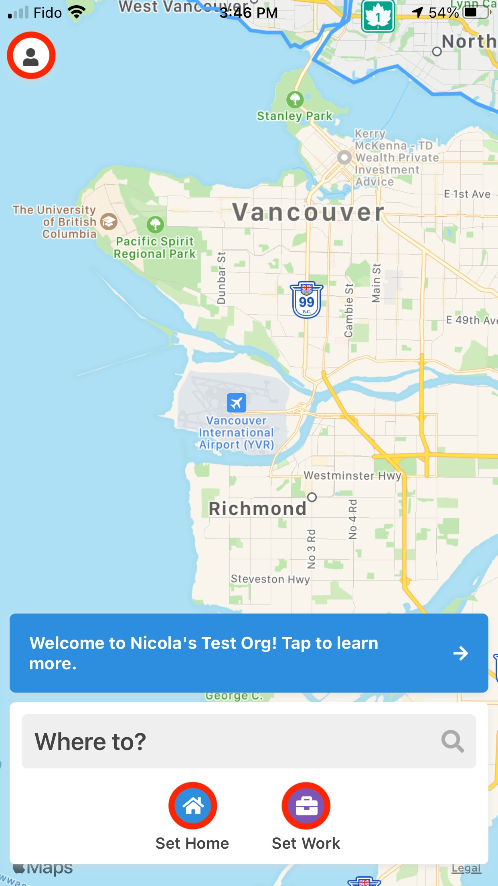
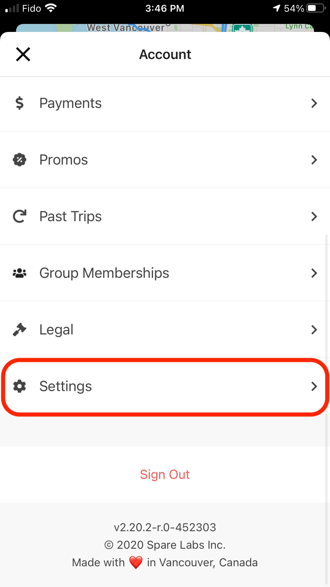
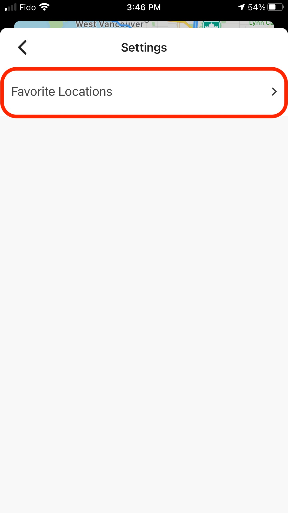
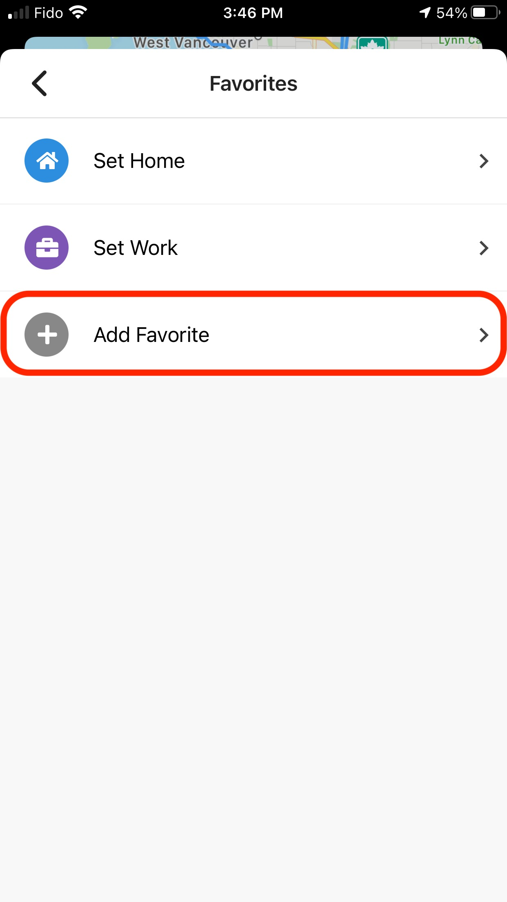
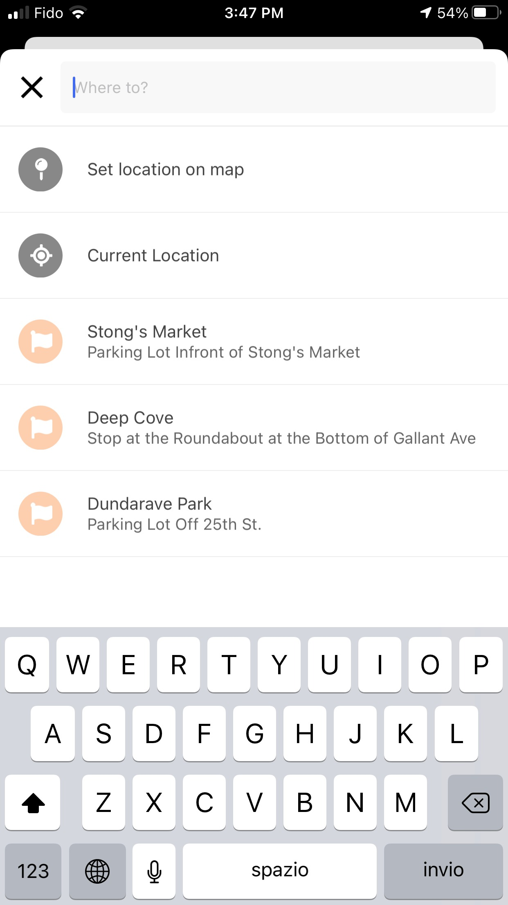
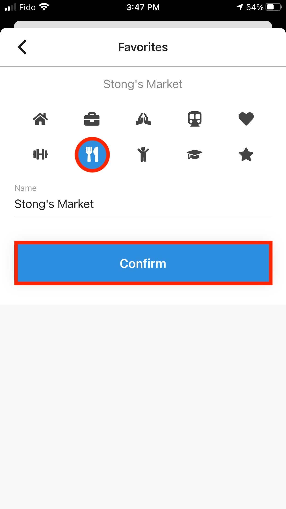
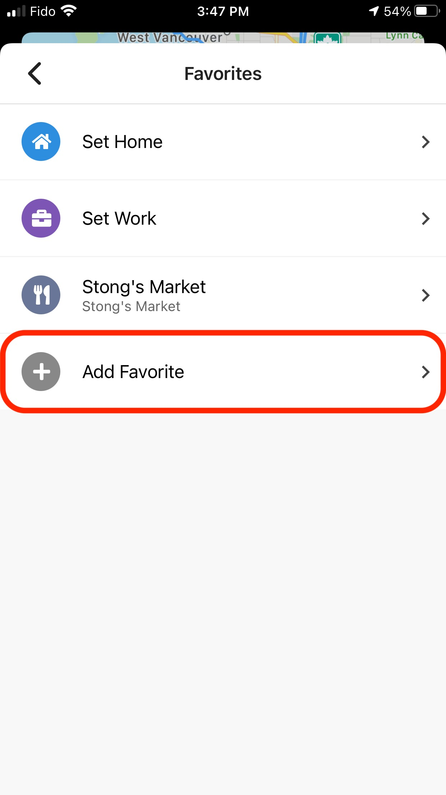
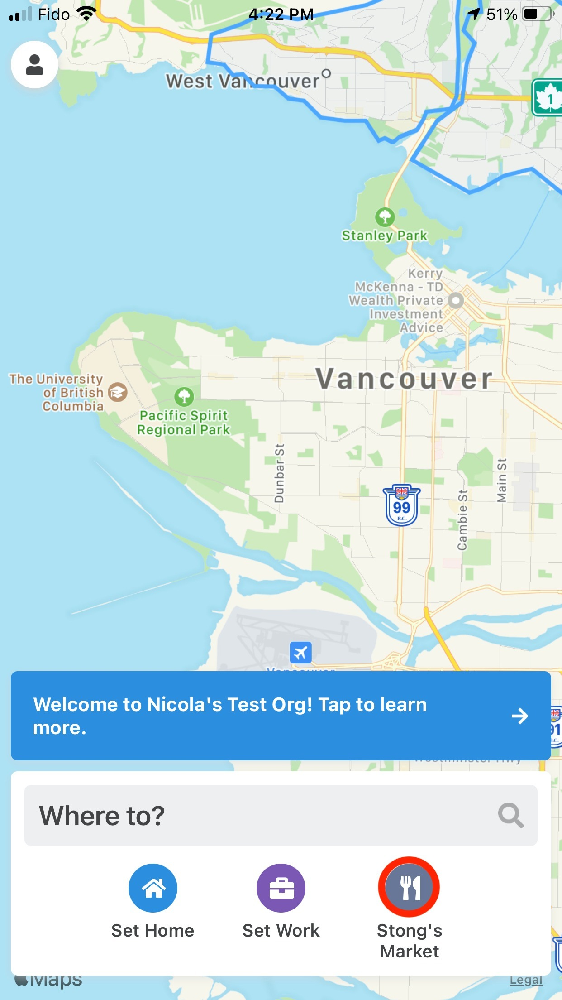
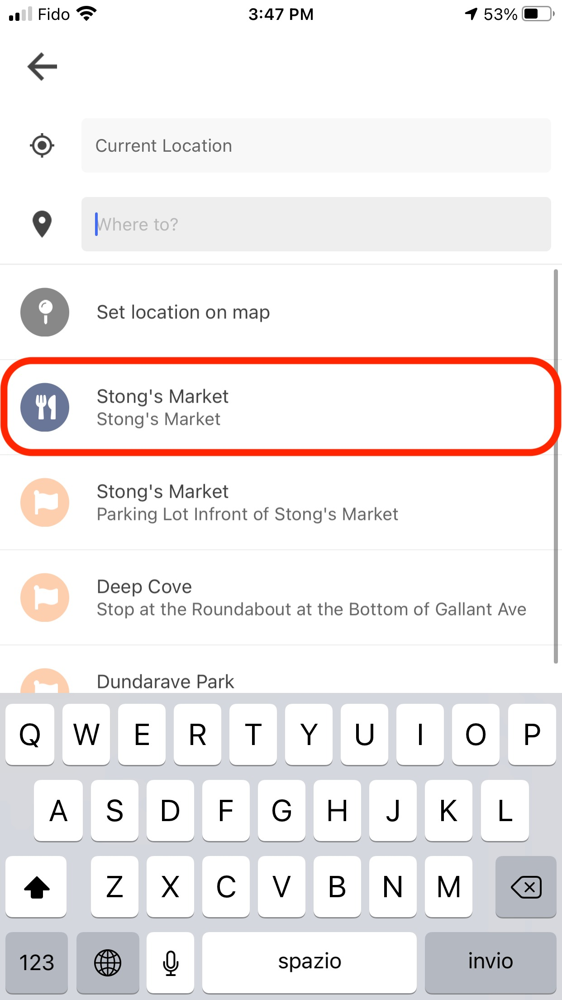

Favourite Locations allow riders to easily select a destination they frequent often without having to re-enter addresses.

In the Spare Rider app, you can set two default favourite locations—Home and Work—by selecting either icon at the bottom of the Home Screen. You can add additional favourite locations by following these steps:

<Info>
You can add up to 30 Favourite Locations (including Work and Home locations).
</Info>

## Adding Favorite Locations

### Prerequisites
- Spare Rider app installed on your device
- Active account with login credentials

### Step-by-step instructions

1. **Log into the Spare Rider app** on your device. You may need to re-enter your telephone number and verification code if you were logged out.

2. Once you have logged in, the home screen will show your current location. Tap the **Account Menu** button in the top left corner of the app (avatar icon).

   

3. Scroll to the bottom of the Account Menu page and click on the **Settings** button.

   

4. Then select **Favourite Locations**. This is where you will be able to see and add your favourite places to your Rider Profile.

   Here, you can set Favourite Locations for your **Home** and **Work** addresses, and any additional locations you frequent often.

   

   

5. **Add Favourite Locations**

   There are a few options for creating a new Favourite Location. You can:

   - Search for a favourite location
   - Set a location on the map
   - Select your current location
   - Choose from a previous destination you have entered (these are listed with the light orange flag icons on the left)

   After you have selected the Favourite Location, you may choose an icon which matches that location. Click the **Confirm** button to ensure your Favourite Location is added to the app.

   Once you select "Confirm", you will be taken back to the screen which displays all of your Favourite Locations. If you want to add another Favourite Location, simply press the "Add Favourite" button again.

   

   

   

## Viewing Favorite Locations

Once you have added favourite locations, they will appear in two places within the app:

### On the Home Screen

When you return to the **Home Screen**, your Favourite Locations will display at the **bottom of the screen** with the matching icon that was selected in the location set-up.

### When Booking a Trip

Your Favourite Locations will also be displayed underneath the search bar when you go to book a trip.

