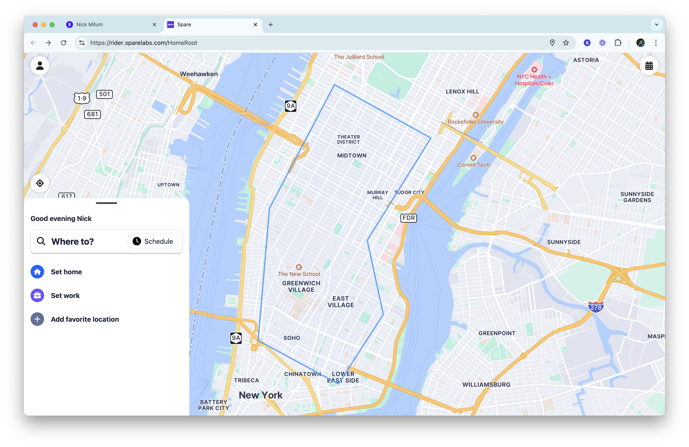

Perhaps you have different types of riders using the same app to book and manage trips. A common example is microtransit and paratransit riders sharing the same tool. However, the microtransit riders are not eligible for paratransit, and therefore shouldn't see the paratransit zones. This feature helps you control zone visibility for particular groups of riders. 

## How does it work?

Firstly, make sure that you have a particular group that you're organizing riders in. 

Maybe it's a group for paratransit riders:

Make sure the paratransit service uses zones restricted to that particular group, and the other services available to the public are left unrestricted. 

This will mean a rider who is part of the "Care-a-Van" group from above would see the whole paratransit zone:

Whereas a rider who isn't part of the group will only see the downtown zone: 

