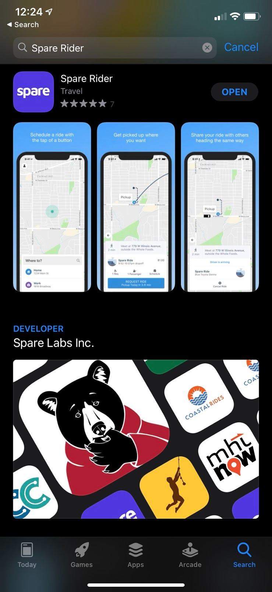
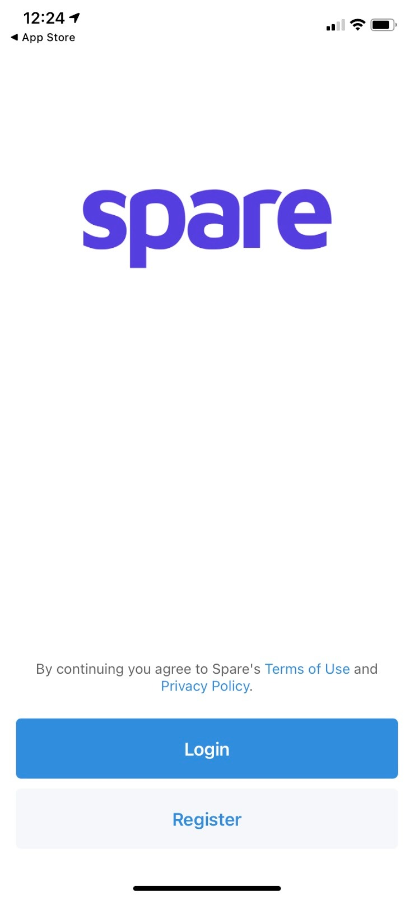
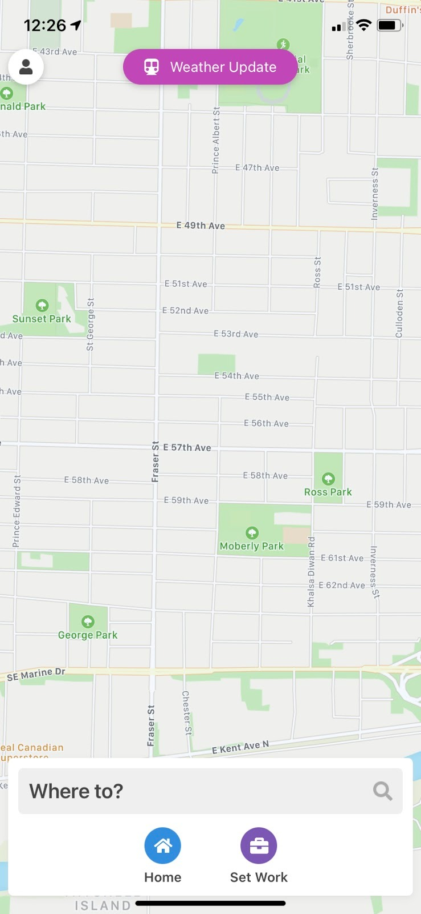
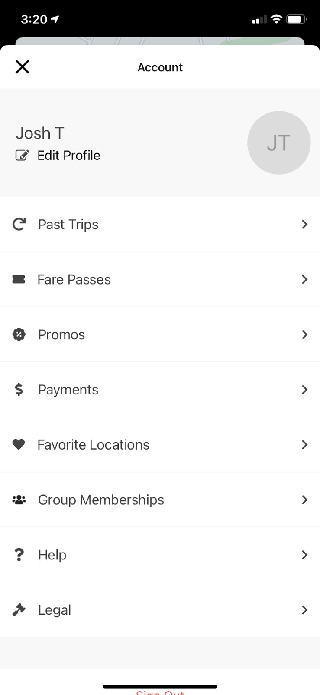
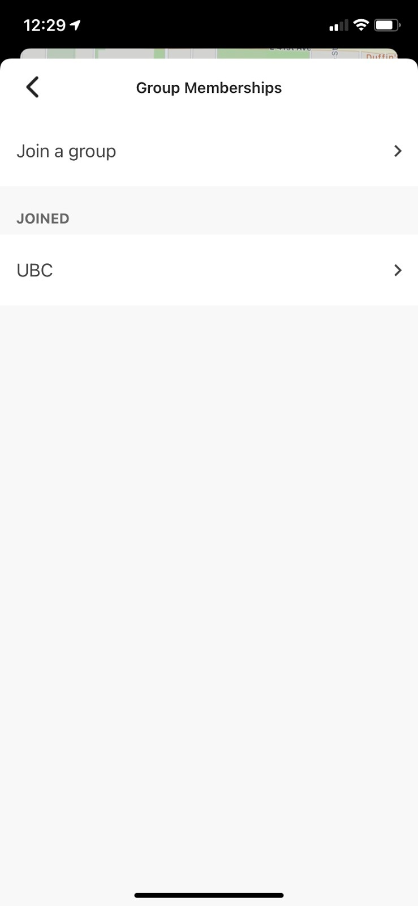
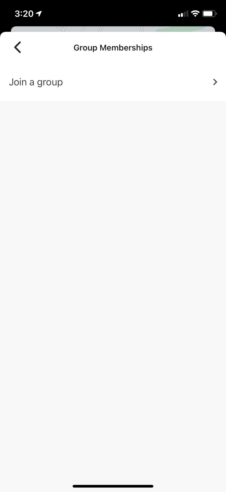
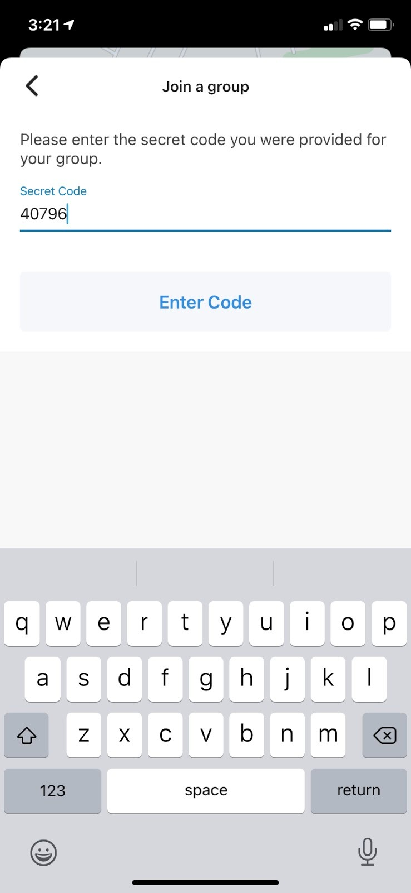
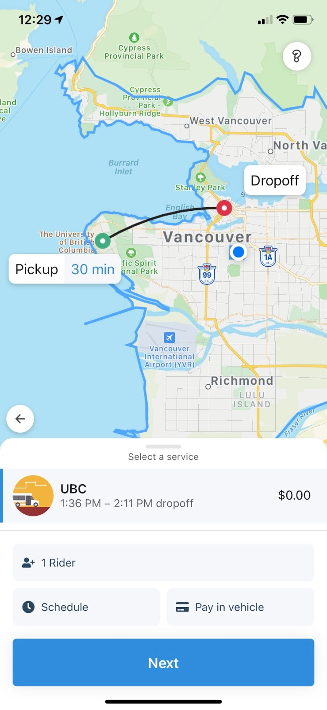

## Prerequisites

Before you begin, you'll need:
- The Spare Rider app or your Mobility Provider's app installed on your device
- Your phone number for registration or login
- A group secret code from your Mobility Provider

## Steps to join a group

Follow these steps to add yourself to a group:

1. **Download and log in to the app**
   
   If you haven't already done so, download the Spare Rider app or the app provided by your Mobility Provider from the App or Play Store. Then, log in if you're already registered or Register with your phone number.

   
   
   

2. **Access Group Memberships**
   
   Select the **"Person"** icon on the top left of the screen and then choose **"Group Memberships".**

   
   
   

3. **Join a group with the secret code**
   
   Choose **"Join a group"** and enter the secret code. You may need to contact your **Mobility Provider** to get the code.

   
   
   
   
   

4. **Confirm successful group membership**
   
   When entered correctly, you will see a new **Group** under **"JOINED".**

## Next steps

Now you're ready to ride. When you search for your destination, you should see a **new Service available** to book your next ride!

